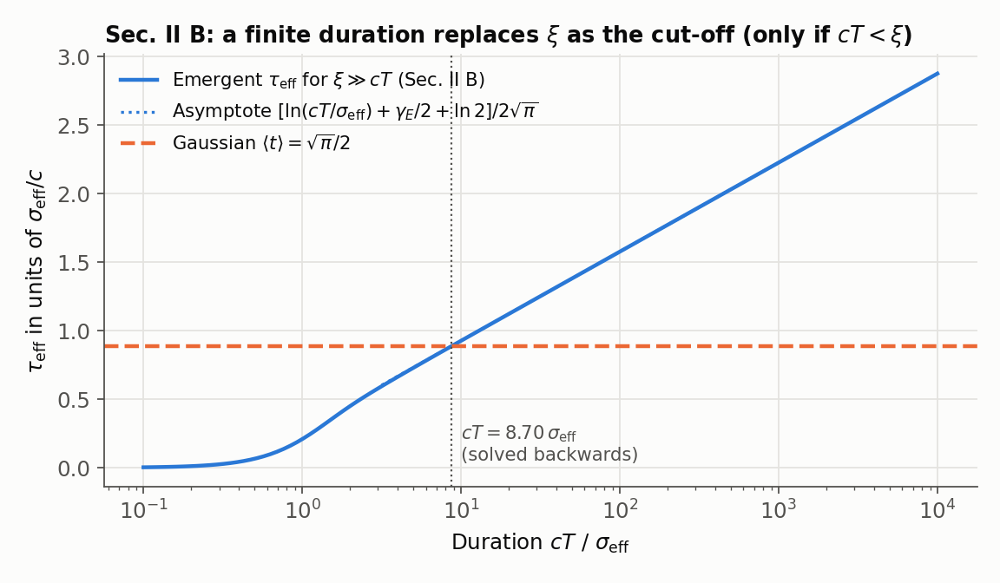
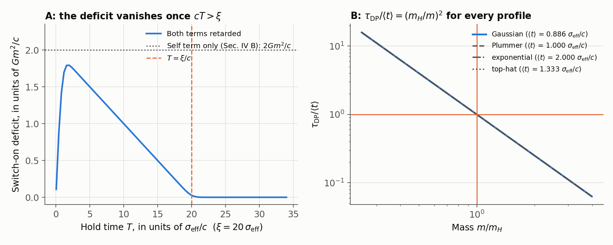
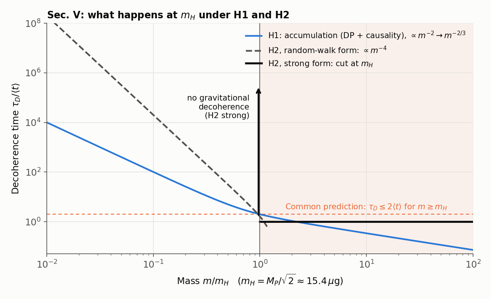

# Causal Consistency of Diósi–Penrose Reduction and a Profile-Independent Mass Scale $M_P/\sqrt2$

[](https://doi.org/10.5281/zenodo.23064101)

Verification code for the manuscript

> T. Namba, *Causal Consistency of Diósi–Penrose Reduction and a
> Profile-Independent Mass Scale $M_P/\sqrt{2}$*, preprint (2026),
> [doi:10.5281/zenodo.23064513](https://doi.org/10.5281/zenodo.23064513).

Every analytical statement, number, table and figure of the paper is checked
by the scripts in this repository.

```
pip install -r requirements.txt
python run_all.py          # 55 checks, about one minute
python make_figures.py     # figures/
```

The full output is in [`results/verification_output.txt`](results/verification_output.txt).

---

## The paper in brief

The Diósi–Penrose (DP) model assigns a spatial superposition the lifetime
$\tau_{\rm DP} = \hbar/\Delta E_G$, computed from the instantaneous Newtonian
self-energy difference of its branches. The paper asks what local relativistic
causality adds to this picture.

1. **Infrared behavior (Secs. II–III).** In a relativistic scalar-field model, a
   finite protocol duration $T$ replaces $\ln(\xi/\sigma_{\rm eff})$ by
   $\ln[\min(\xi, cT)/\sigma_{\rm eff}]$. The dependence on the separation $\xi$
   disappears only for $\xi > cT$; laboratory protocols have $cT \gg \xi$.
2. **A profile-independent identity (Sec. IV).** With the causal self-crossing
   time $\langle t\rangle$ of a branch defined from the retarded Green function,
   $E_{\rm self}\langle t\rangle = Gm^2/c$ for every regular mass profile
   (Proposition 1), hence $\tau_{\rm DP}/\langle t\rangle = (m_H/m)^2$ with
   $m_H = M_P/\sqrt2 \approx 15.39\ \mu$g (Proposition 2). The switch-on action
   deficit of the branch difference vanishes identically by mass conservation.
3. **What happens at $m_H$ (Sec. V).** If the branch phase keeps accumulating
   (H1), the decoherence time bends from $m^{-2}$ to $m^{-2/3}$ at $m_H$. If it is
   not carried beyond $\langle t\rangle$ (H2), the phase per interval is exactly
   $(m/m_H)^2$ and $m_H$ is a Heisenberg cut. Both predict $\tau_D \lesssim
   2\langle t\rangle$ for $m \ge m_H$ and $\xi \gg \sigma_{\rm eff}$.

---

## Where each result of the paper is checked

Each script is named after the section of the paper it verifies.

| Paper | Content | Script | Checks |
|---|---|---|---|
| Sec. II A, Eqs. (6)–(8) | Static field overlap, $I_0$, $I_1$, logarithmic growth | `sec2a_static_field.py` | (a), (b), (d) |
| Sec. II B, Eqs. (9)–(16) | Finite protocol, Dawson function, $J_\infty \simeq 2\ln y + \gamma_E + 2\ln 2$, laboratory limit $J \simeq 2I_1$ | `sec2b_finite_protocol.py` | (a), (b), (c), (e), (f) |
| Sec. III, Table I, Eq. (17) | All numbers of Sec. III, including $y \approx 8.70$ | `sec2b_finite_protocol.py` | (d), (g) |
| Sec. IV B, Eqs. (19)–(20) | Retarded response, causal self-crossing time $\langle t\rangle$ | `sec4b_self_crossing_time.py` | (a)–(f), (h) |
| Sec. IV B, Eqs. (21)–(22) | Arrival fraction $F(t)$, $\int_0^\infty[1-F]\,dt = \langle t\rangle$ | `sec4b_arrival_lag.py` | (a)–(f) |
| Sec. IV C, Eqs. (23)–(24), Table II | Proposition 1 for four profiles; closed forms; unweighted comparison (1.273, 2.000, 1.500, 1.125) | `sec4_propositions.py` | (B1)–(B3), (B8), (B9) |
| Sec. IV D, Eqs. (25)–(28) | Proposition 2; SI value of $m_H$; finite separation $m_H(\xi)$ | `sec4_propositions.py` | (B4)–(B7) |
| Sec. IV E, Eq. (29) | Switch-on deficit of the branch difference vanishes | `sec4_propositions.py` | (A1)–(A3) |
| Sec. V A, Eqs. (30)–(33) | H1: $\tau_D = \langle t\rangle[1+(m_H/m)^2]$ below, $(6/a)^{1/3}c^{-1}(m_H/m)^{2/3}$ above; bend at $m_H$ | `sec5_what_happens_at_mH.py` | (a)–(f), (k) |
| Sec. V B, Eqs. (34)–(35) | H2: phase per interval $(m/m_H)^2$; random-walk form $\propto m^{-4}$ | `sec5_what_happens_at_mH.py` | (g), (h) |
| Sec. V C, Table III | Common prediction $\tau_D \le 2\langle t\rangle$; SI illustration (3 ns, 6 ms) | `sec5_what_happens_at_mH.py` | (i), (j) |
| Fig. 1 | Decoherence time under H1 and H2 | `make_figures.py` → `figures/paper_fig1_decoherence_time.pdf` | — |

Checks not listed above are supplementary; see the end of this file.

---

## Results by section

### Secs. II–III: infrared behavior of the field model

A massless scalar field stands in for the Newtonian potential. For static,
perpetual branches the decoherence exponent is $\Gamma = \Delta E_G\,\tau_{\rm eff}/\hbar$
with $\tau_{\rm eff}/(\sigma_{\rm eff}/c) = I_1(x)/[4I_0(x)]$, and $I_1$ grows as
$\ln(\xi/\sigma_{\rm eff})$. A finite protocol multiplies each mode by
$4\sin^2(ckT/2)$:

| Regime | Result | Check |
|---|---|---|
| $\xi \gg cT$ | $J_\infty(y) = 4\int_0^y D(s)\,ds \simeq 2\ln y + \gamma_E + 2\ln 2$; independent of $\xi$ | `sec2b` (a)–(c) |
| $cT \gg \xi$ (laboratory) | $J \simeq 2I_1(\xi/\sigma_{\rm eff})$; the logarithm of $\xi$ survives | `sec2b` (e), (g) |
| Protocol tuning | $\tau_{\rm eff} = (\sqrt\pi/2)\,\sigma_{\rm eff}/c$ needs $y \approx 8.70$ | `sec2b` (d) |



### Sec. IV: the causal self-crossing time and Propositions 1–2

For a pair-separation distribution $p(r)$ of one branch
($\int_0^\infty p\,dr = 1$), the retarded response to an impulsive source is
$\phi_{\rm ret}(t) = p(ct)/(4\pi t)\,\Theta(t)$, and

$$
\langle t\rangle = \frac{1}{c}\frac{\int p\,dr}{\int (p/r)\,dr},\qquad
E_{\rm self}\langle t\rangle = Gm^2\!\int_0^\infty\!dt\int_{ct}^\infty\frac{p}{r}\,dr = \frac{Gm^2}{c}.
$$

| Profile | $\langle 1/r\rangle_p$ | $c\langle t\rangle$ | $E_{\rm self}\langle t\rangle/(Gm^2/c)$ |
|---|---|---|---|
| Gaussian | $2/(\sqrt\pi\,\sigma_{\rm eff})$ | $(\sqrt\pi/2)\,\sigma_{\rm eff}$ | 1 |
| Plummer | $1/b$ | $b$ | 1 |
| Exponential | $1/(2\ell)$ | $2\ell$ | 1 |
| Uniform | $3/(2R)$ | $2R/3$ | 1 |

With $\Delta E_G^{\rm sat} = 2E_{\rm self}$ and $\tau_{\rm DP} = \hbar/\Delta E_G^{\rm sat}$,
$\tau_{\rm DP}/\langle t\rangle = (m_H/m)^2$ for every profile and width. In SI
units $\tau_{\rm DP} = \langle t\rangle$ at $m_H = 15.39\ \mu$g for
$\sigma_{\rm eff} = 1$ nm, 1 µm and 1 mm alike. For the full branch difference
the switch-on deficit is $(G/c)(\int\Delta\rho)^2 = 0$: cross terms are small
but arrive late and cancel the self terms.



### Sec. V: what happens at $m_H$

| Hypothesis | $m < m_H$ | $m \ge m_H$ |
|---|---|---|
| DP (instantaneous) | $\langle t\rangle(m_H/m)^2$ | $\le \langle t\rangle$ (not self-consistent) |
| H1 | $\langle t\rangle[1 + (m_H/m)^2]$ | $\propto m^{-2/3}$, $\le 2\langle t\rangle$ |
| H2, strong | no gravitational decoherence | $\le \langle t\rangle$ |
| H2, random walk | $\simeq 2\langle t\rangle(m_H/m)^4$ | $\lesssim 2\langle t\rangle$ |



---

## Conventions

- $\Delta E_G = G\int\!\!\int \Delta\rho(\mathbf x)\Delta\rho(\mathbf y)/|\mathbf x-\mathbf y|
  = 2[E_{\rm self} - E_{\rm int}]$ and $\tau_{\rm DP} = \hbar/\Delta E_G$. With
  $\Delta E_G/2$ instead, $m_H = M_P$; profile independence is unaffected.
- Gaussian branches $\rho_\pm \propto \exp(-|\mathbf x \mp \boldsymbol\xi/2|^2/\sigma^2)$
  give the pair distribution $\propto \exp(-r^2/\sigma_{\rm eff}^2)$ with
  $\sigma_{\rm eff}^2 = 2\sigma^2$ (plus an optional intrinsic resolution $\sigma_0^2$).
- Units in the scripts: $G = c = m = \sigma_{\rm eff} = 1$ (and $\hbar = 1$
  where masses are compared with $m_H$) unless SI units are stated.

## Caveats

1. **Scalar surrogate.** Gravity is a tensor field; numerical factors in
   Secs. II–III will change, but not the pair-by-pair cancellation behind
   Proposition 1.
2. **Idealized switching.** Sudden switching is a model of the
   split–hold–recombine protocol, not a solution of the dynamics that creates
   the branches.
3. **H2 is a hypothesis.** A mechanism that prevents both coherent and random
   accumulation of the branch phase beyond $\langle t\rangle$ has not been derived.

## Supplementary checks

These are part of the development of the analysis and are not used in the paper.

- `sec2a_static_field.py` (c): the mode average of the static field model gives
  $\tau_{\rm eff} \to \sigma_{\rm eff}/(4\sqrt\pi c)$ at small separations, i.e.
  $1/(2\pi)$ of the Gaussian $\langle t\rangle$; `sec4b_self_crossing_time.py` (i)
  confirms the ratio.
- `supp_retarded_gaussian.py`: a retarded Gaussian time profile gives
  $\Delta S = C\,Gm^2/c$ with $C(u) = 4u/(1 + 1/4u^2)$; $C$ depends on the
  assumed width, so the protocol does not fix a universal coefficient.
- `sec4b_self_crossing_time.py` (g) and `sec4b_arrival_lag.py` (g): with the
  self-term only, $\Delta E_G^{\rm sat}\langle t\rangle = 2Gm^2/c$; Sec. IV E shows
  why this cannot be read as the switch-on deficit of the full branch difference.
- Figures `supp_fig1_static_overlap.png` and `supp_fig2_retarded_gaussian.png` illustrate these
  supplementary checks; the `fig_sec*` figures illustrate the corresponding sections of the paper.

## How to cite

Please cite the paper,

> T. Namba, *Causal Consistency of Diósi–Penrose Reduction and a Profile-Independent
> Mass Scale $M_P/\sqrt{2}$*, preprint (2026), [doi:10.5281/zenodo.23064513](https://doi.org/10.5281/zenodo.23064513),

and, if you use this code, the archived version:

> T. Namba, *causal-consistency-dp-reduction: verification code*, version v1.0.0,
> Zenodo (2026), [doi:10.5281/zenodo.23064101](https://doi.org/10.5281/zenodo.23064101).

## Acknowledgment

The analysis and code were developed with the assistance of AI tools (Google
Gemini, Anthropic Claude and OpenAI ChatGPT). Every result stated above is
checked by the scripts in this repository.

## License

MIT
